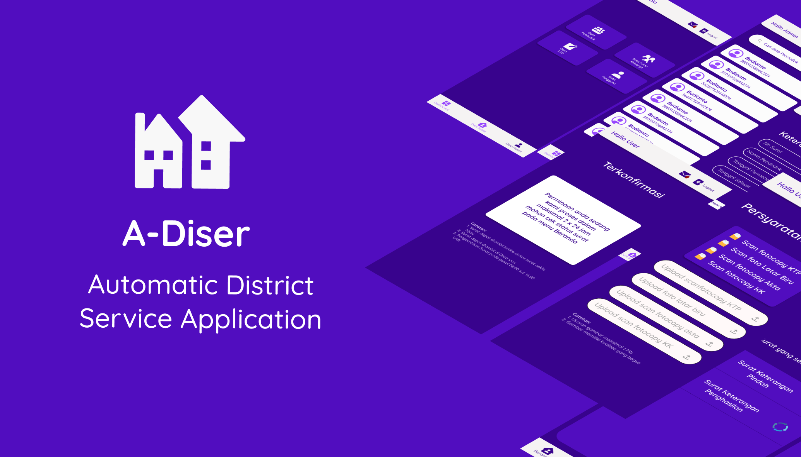

# A-diser

### Automatic District Service Application
##### CC22-PC417 Bangkit Academy 2022
##### Team: 
1.M2006F0591 - Muhammad Salman Ikrar Musyaffa - Universitas Brawijaya  
2.M2313G2715 - Irena Kusuma Dewi - Universitas Siliwangi  
3.C7307F2631 - Gadis Mustika  - Universitas Raharja 

***
#### Introduction 
A-diser is a service application for village population administration activities, this application is to assist the village office in conducting population data collection without having to do it manually and also helping residents to send a letter of requirements without having to queue up to the village office just waiting for the processing results.

